  

<a href="#about">About</a>&nbsp;&nbsp;·&nbsp;&nbsp;<a href="#selected-work">Work</a>&nbsp;&nbsp;·&nbsp;&nbsp;<a href="#stack">Stack</a>&nbsp;&nbsp;·&nbsp;&nbsp;<a href="#experience">Experience</a>&nbsp;&nbsp;·&nbsp;&nbsp;<a href="#contact">Contact</a>

  

 

## About

I finished my BEng in **Software Engineering, Data Engineering specialisation**, at VIA University College in Horsens. I build things end to end: the model, the API behind it, and the interface people actually touch.

Two of my sites run in production today, one of them behind an international tournament that has been going for 26 years.

`Aarhus, Denmark` &nbsp; `Latvian and Russian native` &nbsp; `English fluent` &nbsp; `Danish B2`

 

## Selected work

<table>
<tr>
<td width="50%" valign="top">

### Event ecosystem
**Bachelor project**

A full social platform for events, built across every surface. A React Native mobile app, a Next.js web app and public site, a Supabase backend, and a Python model that predicts how trendable an event will be so organisers can see what will land before they commit to it.

`React Native` `Next.js` `Supabase` `Python` `ML`

</td>
<td width="50%" valign="top">

### Riga Cup
**[rigacup.lv](https://www.rigacup.lv)**

The site behind an international youth football tournament in Riga, now in its 26th edition, drawing clubs and academies from Scandinavia, the Baltics and across Europe. Built and maintained by me, live year round.

`Production` `Live`

</td>
</tr>
<tr>
<td width="50%" valign="top">

### Sport Teamline
**[sport-teamline.dk](https://sport-teamline.dk)**

A teamwear webshop taken from design through to deployment: storefront, product catalogue and checkout. Live.

`E-commerce` `Production`

</td>
<td width="50%" valign="top">

### Portfolio
**[blaizans.vercel.app](https://blaizans.vercel.app/)**

My personal site, where the longer write ups live. [Source](https://github.com/blaizans/Portfolio).

`Next.js` `React` `Tailwind`

</td>
</tr>
</table>

<b>Earlier projects</b>

 

- **[VIATAB](https://github.com/blaizans/VIATAB)** &nbsp;|&nbsp; _one line: what it is and who it was built for_
- **[Pokedex](https://github.com/blaizans/pokedex)** &nbsp;|&nbsp; Pokédex app on the PokéAPI: search, browse and inspect species data
- **[n-Queens](https://github.com/blaizans/nQueensProblem)** &nbsp;|&nbsp; backtracking solver for the classic n-Queens constraint problem

 

## Stack

<table>
<tr>
<td valign="middle"><b>Data and ML</b></td>
<td valign="middle">   </td>
</tr>
<tr>
<td valign="middle"><b>Backend</b></td>
<td valign="middle">    </td>
</tr>
<tr>
<td valign="middle"><b>Data stores</b></td>
<td valign="middle">   </td>
</tr>
<tr>
<td valign="middle"><b>Frontend</b></td>
<td valign="middle">     </td>
</tr>
<tr>
<td valign="middle"><b>Cloud and ops</b></td>
<td valign="middle">     </td>
</tr>
</table>

 

## Experience

**Student Software Test Engineer**, Systematic &nbsp;·&nbsp; 2024 to 2026

 

## Activity

<picture>
  <source media="(prefers-color-scheme: dark)" srcset="https://raw.githubusercontent.com/blaizans/blaizans/output/snake-dark.svg" />
  <source media="(prefers-color-scheme: light)" srcset="https://raw.githubusercontent.com/blaizans/blaizans/output/snake.svg" />
  
</picture>

 

## Contact

Open to **data engineering and fullstack** roles, remote or on site in Denmark.

<a href="https://www.linkedin.com/in/bruno-laizans/">LinkedIn</a>&nbsp;&nbsp;·&nbsp;&nbsp;<a href="https://blaizans.vercel.app/">Portfolio</a>&nbsp;&nbsp;·&nbsp;&nbsp;<a href="mailto:blaizans02@gmail.com">Email</a>
